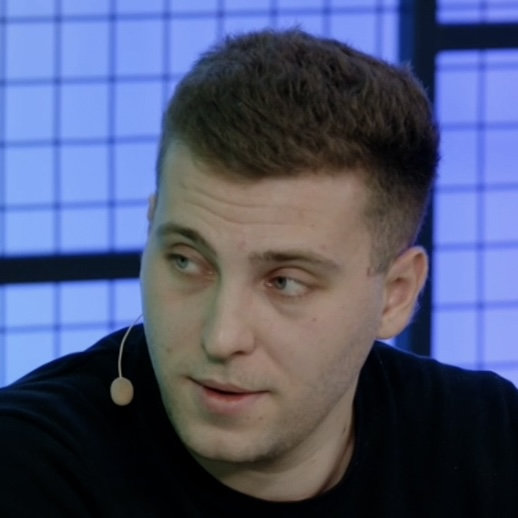

  
  

    <h1>Дмитрий Труфанов</h1>
    
<strong>Телефон:</strong> +7(962)401-28-58

    
<strong>Email:</strong> <a href="mailto:d_trufanov@list.ru">d_trufanov@list.ru</a>

    

      <a href="https://t.me/dimi3_tru">Telegram</a> |
      <a href="https://hh.ru/resume/5f63a69eff0828b95f0039ed1f6e7644464578">hh.ru</a> |
      <a href="https://www.linkedin.com/in/%D0%B4%D0%BC%D0%B8%D1%82%D1%80%D0%B8%D0%B9-%D1%82%D1%80%D1%83%D1%84%D0%B0%D0%BD%D0%BE%D0%B2-a651711b3?utm_source=share&utm_campaign=share_via&utm_content=profile&utm_medium=ios_app">LinkedIn</a> |
      <a href="https://github.com/dimi3tru">GitHub</a> |
      <a href="https://dimi3tru.github.io/">GitHub Pages</a>
    

  

## EDUCATION

**HSE University** (Moscow, Russia)  
_Бакалавриат_: Факультет Экономических Наук (ФЭН), «Экономика и статистика» (2019-2023)  
• GPA: 8.72 / 10, диплом с отличием  
_Магистратура_: Факультет Компьютерных Наук (ФКН), «Финансовые технологии и анализ данных» (2023-2025)   
• GPA: 9.12 / 10, диплом с отличием

## WORK EXPERIENCE

**Alfabank** – _Personnel Efficiency Directorate_ (Moscow, Russia)  
**_AI Product Lead (IC)_** (June 2025 – Present)  

•	Инициировал и сопровождал разработку первых AI-агентов (агент-клиент) в поддержке банка, защитил амбицию по эффектам перед финансовым департаментом (~200 млн. руб.);  
•	Управлял бэклогом AI инициатив в Альфа-помощнике оператора в поддержке, защитил вместе с PO эффекты за первые 3 квартала 2025 года (~70 млн. руб.). 
Разработанные модели: голосовой ввод (ASR+LLM), генеративные ответы (RAG по вопросам клиента), нейропоиск БЗ (RAG по вопросам сотрудника), несколько моделей суммаризации и автоклассификации и др.;  
•	Написал MVP QMS (quality management system) для доставки (ИИ-аналитика диалогов сотрудников выездного канала с клиентами по телефону);  
•	Сопровождал внедрение модели маршрутизации из дома (~30 млн. руб.);  
•	Инициировал и сопровождал разработку модели маршрутизации сателлитов (~20 млн. руб.);  
•	Разработал и защитил перед топ-менеджментом AI cтратегию развития сервиса и доставки банка.  

---

**Sber** – _DTaaS, AI cluster (Digital Transformation as a Service)_ (Moscow, Russia)  
**_Senior Data Scientist_** (September 2024 – June 2025)  

• Построил модель суммаризации транскрибированных диалогов для сокращения временных затрат сотрудников банка (интеллектуальная суммаризация), ~150 млн. руб. ежегодно (выступление на СберБизнесКонференции);  
• Разработал алгоритм автоматического извлечения информации из договоров кредитных линий для автоматизации системы кредитного мониторинга (кредитная линия EverGreen);  
• Разработал модель скоринга новостей (CNews) для поиска кейсов цифровой трансформации;  
• Создал бота (RAG) для автоматизации подбора релевантных кейсов внедрения AI в бизнесе;  
• Консультирование представителей крупного бизнеса (ЛПР) в сфере AI/ML/DL (цифровая трансформация).  

---

**HSE University** – _Institute of Artificial Intelligence and Digital Sciences_ (Moscow, Russia)  
**_Data Scientist_** _(part-time job)_ (January 2025 – May 2025) 

•	Разработка рекомендательной системы с использованием LLM (Data Mining) для ведущего luxury-ритейлера РФ;  
•	Создание AI системы для подбора туристических туров по запросу на естественном языке.  

---

**Yandex** – _Inhouse Consulting, Ads_ (Moscow, Russia)  
**_Data Scientist / Product Analyst_** (June 2023 – September 2024)  

•	Разработал модель оценки потенциала новых клиентов: сокращение обрабатываемой сейлами базы на 93%, увеличение среднего чека на 156%, инкремент LTV ~500 млн. руб. ежегодно (выступление на Хурале);  
•	Построил генеральный дашборд для всех команд онбординга с основными фин. метриками;  
•	Повысил эффективность работы команд онбординга: сократил издержки на 40% (по результатам A/B одна команда была расформирована);  
•	Исследовал операционные процессы работы черна: реструктуризировали работу команд, инкремент ~54 млн. руб. ежегодно;  
•	Выявил наиболее частые рекомендации модели аудита рекламного кабинета у отточных клиентов (помогло увеличить качество работы команд черна);  
•	Разработал дамми модель маршрутизации клиентов на входе (простой / сложный продукт);  
•	Перенёс скрипты команды бизнес-аналитиков на новый контур через Arc (аналог Git).  

---

**Burger King** – _Pricing department_ (Moscow, Russia)  
**_Data Scientist / Product Analyst_** (January 2022 – June 2023)  

• Построил ML-кластеризацию ресторанов по данным соц. опросов: прирост выручки на 2,7%;  
• Рассчитал эластичность спроса по цене для групп товаров и каждого по отдельности: упростило прайсинг и моделирование спроса в ресторанах;  
• Подбор и обновление промо-механик: благодаря созданию купонов трафик-драйверов прирост incidence (аналог retention) на 13%, прирост прибыли на 1,7%;  
• Прайсинг upsell товаров: увеличение объёмов продаж на 11%, прибыли на 1,2%.  

---

**Ozon** – _Retail department_ (Moscow, Russia)  
**_Analyst (Intern)_** (August 2021 – January 2022) 

• Создал множество дашбордов для мониторинга финансовых показателей всех БЮ;  
• Создал ежедневную автоматизированную выгрузку для детекции самых убыточных товаров.  

---

**HSE University** – _Faculty of Economic Sciences_ (Moscow, Russia)  
**_Teaching Assistant_** _(Mathematical Analysis, Probability Theory)_ (September 2020 – June 2021)  

• Проверка домашних заданий и контрольных работ студентов;  
• Проведение дополнительных занятий и консультаций (подготовка студентов к экзамену).  

## Side Projects
• RAG бот-ассистент для одной из крупнейших ветеринарных клиник РФ;	(June – August 2025)  
• Рекомендательная система для luxury-ритейлера РФ; (January – June 2025)  
• MVP AI Agents системы для подбора туристических туров; (April 2025)  
• Антифрод модель на страховом портфеле; (April – May 2023)  
• Прайсинг скидок на товары Рив Гош. (August – September 2022)  

## HARD SKILLS

• Python (AI, ML, DL, EDA, Pytorch, Tensorflow etc.)  
• NLP (LLM+PEFT, RAG, AI Agents, LLM)  
• CV (CNN, ViT, DDPM, VLM)  
• SQL, PySpark, Git, BI (DataLens, Tableau, Power BI)  
• Git  
• R  
• MS Office (Excel, PowerPoint)  
